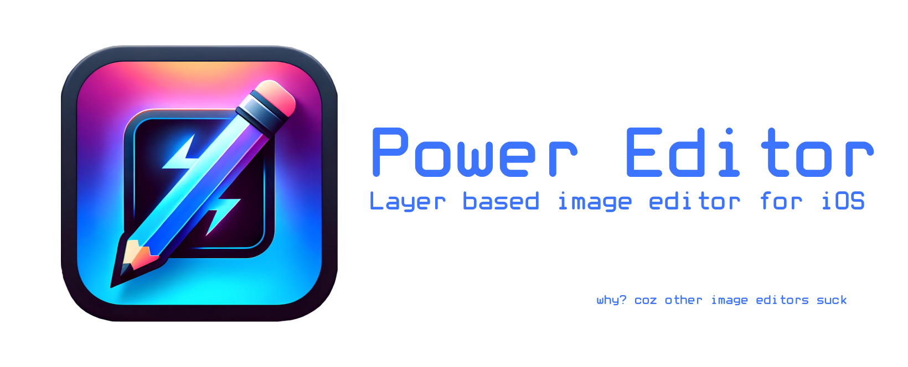

 :3

## Installation

Or if you have [AltStore](altstore.io) setup, you can also download the .ipa file from the [latest release](https://github.com/ankushKun/power-editor/releases) and install it using AltStore for free. Although I would appreciate if you buy it and also leave a review ;)

## Features

- [x] Add Image layer
- [x] Add Text layer
- [ ] Add Shape layer (✓Rectangle, todo:add more shapes)
- [x] Export workspace as image (need to add configurable options)
- [ ] Save project (.pow) (possibilities on making this photoshop compatible?)
- [ ] Load Saved project
- [ ] Undo/Redo
- [ ] History
- [ ] Configurable workspace (image size, background color, etc)

Layers
- [x] Naming
- [x] Ordering
- [x] Locking
- [x] Visibility
- [x] Opacity
- [ ] Grouping
- [ ] Masking
- [ ] Blending Modes

Transforms
- [x] Drag
- [x] Scale
- [x] Rotate
- [ ] Flip
- [x] Aspect Ratio Toggle

\+ More to come

## Contributing

If you want to see a feature implemented or want to contribute, feel free to open an issue or a pull request. I would love to see this project grow with the community.

If you are working on a feature, please do let me know in advance so that we can avoid any conflicts.

NOTE: This project is built using SwiftUI and is only available for iOS. If you want to contribute, make sure you have a Mac with Xcode installed. 

## License

<a property="dct:title" rel="cc:attributionURL" href="https://github.com/ankushKun/power-editor">Power Editor</a> by <a rel="cc:attributionURL dct:creator" property="cc:attributionName" href="https://x.com/ankushKun_">Ankush Singh</a> is licensed under <a href="https://creativecommons.org/licenses/by-nc-sa/4.0/?ref=chooser-v1" target="_blank" rel="license noopener noreferrer" style="display:inline-block;">CC BY-NC-SA 4.0</a>

